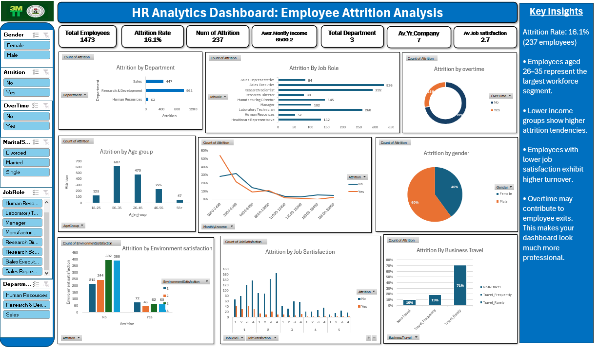

# HR Analytics Dashboard: Employee Attrition Analysis

An interactive Excel dashboard that explores why employees leave an organisation. It combines headline KPIs, slicers and charts to help HR teams spot the groups and working conditions most associated with attrition.

## Project Objective

Answer one business question: **which employee groups and working conditions are most associated with attrition, and where should HR focus retention efforts?**

## Headline KPIs

| Metric | Value |
|---|---|
| Total employees | 1,473 |
| Attrition rate | 16.1% |
| Employees who left | 237 |
| Average monthly income | 6,500.2 |
| Departments | 3 (Sales, Research & Development, Human Resources) |
| Average years at company | 7 |
| Average job satisfaction | 2.7 |

## Dashboard Features

- **Slicers:** Gender, Attrition, OverTime, Marital Status, Job Role, Department
- **Charts:** Attrition by department, job role, overtime, age group, monthly income band, gender, environment satisfaction, job satisfaction and business travel

## Key Insights

1. Overall attrition is **16.1%** (237 of 1,473 employees).
2. Employees aged **26-35** form the largest age group, followed by 36-45.
3. **Lower income bands** show higher attrition, and attrition falls as income rises.
4. Employees with **lower job satisfaction** show higher turnover.
5. **Overtime** may contribute to employee exits.

## Recommendations

1. Review pay for lower income bands, where attrition is highest.
2. Run regular job satisfaction surveys and follow up on low scores.
3. Monitor overtime and workload, especially in high-attrition roles.
4. Target retention programmes at employees aged 26-35.

## Tools Used

- Microsoft Excel (PivotTables, PivotCharts, slicers, KPI cards)

## How to Use

1. Download the Excel workbook from this repository.
2. Open it in Excel (2016 or later recommended).
3. Use the slicers on the left to filter by gender, overtime, marital status, job role and department.

## Author

**Esther**
GitHub: [Esther434](https://github.com/Esther434)
LinkedIn:www.linkedin.com/in/orjiude-esther
